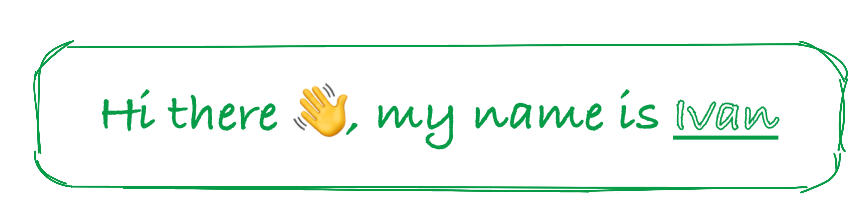

  

I`m Java Spring Developer from Russia 🇷🇺

### About me

- ❤️ I love Java and Spring. I find joy in experimenting with Spring, delving into its inner workings, and creating my own projects
- 🧐 I embrace challenges and enjoy finding innovative solutions to problems that come my way
- 🤖 I've been developing my own library called [spring-boot-starter-telegram](https://github.com/Drednote/spring-boot-starter-telegram) 
  for Telegram bots within the Spring ecosystem. While it's still a work in progress, 
  I'm excited to keep improving it! 😬
- 👉👈 I know Javascript, Typescript, React at the "I can make a simple website" level
- 💻 I've created a website that provides comprehensive information about me. 
  You can check it out [here](https://drednote.github.io)
- 💬 Feel free to reach out to me through the contact details available in the biography section. 
  I'd love to connect and chat!

### Language and tools:

<code></code>
<code></code>
<code></code>
<code></code>
<code></code>
<code></code>
<code></code>
<code></code>
